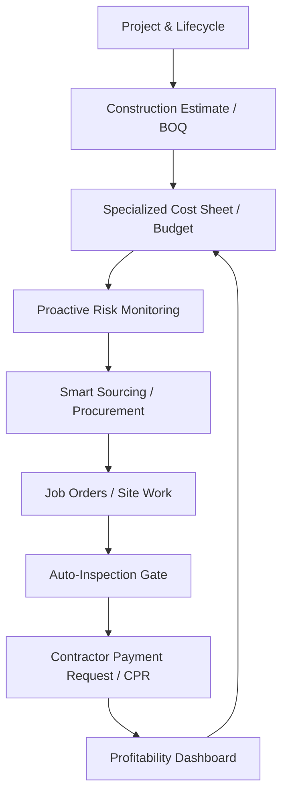

# Construction ERP: Professional User Manual & Implementation Guide

## 1. Executive Summary
The **Construction ERP** module for Odoo 16 is a high-precision vertical solution designed for construction firms, developers, and civil contractors. It bridges the gap between site-level physical mobilization and office-level financial auditing through a **Closed-Loop Operational Engine**.

### Core Value Proposition
- **Specialized Costing**: Materials, Labor, Equipment, Vehicles, and Overheads are tracked in isolated, high-precision models.
- **Proactive Risk Intelligence**: Automated detection of procurement bottlenecks for long-lead materials.
- **Closed-Loop Contractor Workflow**: Digital job offering with an automated Quality Inspection gate.
- **Unified Reality**: Financial dashboards roll up real-time site data into a single source of truth.

---

## 2. Technical Architecture & Data Flow
The system operates on an integrated circular logic:

---

## 3. The 7 Pillars of Construction ERP

### I. Project Lifecycle Management
Everything starts with a **Lifecycle Template**. 
- **Setup**: Define standard stages (e.g., Mobilization, Substructure, Superstructure, MEP).
- **Automation**: When a project is created, the system synchronizes the status roadmap to the **Project Form**, providing instant visual progress tracking.

### II. High-Precision Specialized Costing
The **Master Cost Sheet** is now divided into 5 specialized categories for surgical accuracy:
- **Material Budget**: Track cement, steel, and timber with lead-time monitoring.
- **Labor Budget**: Plan roles (Foreman, Mason, Electrician) with role-based rates.
- **Equipment Budget**: Manage machine hours for cranes, excavators, and generators.
- **Vehicle Budget**: Track fleet mobilization and operational fuel costs.
- **Overhead Budget**: Capture site office costs, utilities, and permits.

### III. Proactive Procurement Risk Detection
The system acts as your "Early Warning Radar":
- **Risk Detector**: Scans your Material Budget for items with long lead times that haven't been ordered yet.
- **Management Alerts**: Critical risks are flagged on the Project Dashboard to prevent supply chain bottlenecks.

### IV. Closed-Loop Contractor Lifecycle (Job Orders)
Transform daily site work into a digitally managed workstream:
- **Job Offering**: Digital offers sent to contractors with technical specs.
- **Mobilization Triggers**: Contractors use "Start Work" and "Report Finished" triggers to record precise site timestamps.
- **Auto-Inspection Gate**: Finishing a job auto-triggers a **Quality Inspection**. Approving the inspection is the ONLY way to unlock the payment process.

### V. Financial Audit Trail (Reference Linking)
Every dollar is traceable back to its budget origin:
- **Polymorphic Linking**: Vendor bills use a **Reference System** to link directly to specialized Material, Labor, or Equipment budget lines.
- **Suggestion Engine**: The system automatically suggests the correct budget line when a product is selected on a Vendor Bill.

### VI. HSE & Quality (Safety First)
- **Permit to Work (PTW)**: Digital authorization for high-risk activities.
- **NCRs (Non-Conformance)**: Failed inspections automatically move Job Orders to "Rework Required" and can trigger formal NCR reports.

### VII. Financial Profitability & Payments
- **Progress Certification (CPR)**: Automates Gross Amount calculation, Retention holdings, and Net Payables.
- **Automated Billing**: Passing a quality inspection automatically triggers the payment readiness state, ensuring only quality work is paid for.

---

## 4. Key Role-Based Workflows

| Role | Primary Responsibility | Key Actions |
| :--- | :--- | :--- |
| **Project Manager** | Financial & Schedule Oversight | Approving Estimates, Variations, and CPRs. |
| **Site Supervisor** | Physical Execution & Safety | Managing Job Order Mobilization, HSE Permits. |
| **Quality Inspector** | Standards & Certification | Approving/Declining Job Order Inspections. |
| **Procurement Officer** | Sourcing & Supply Chain | Monitoring Sourcing Risks, Managing POs. |
| **Financial Auditor** | Cost Control & Profitability | Analyzing Specialized Cost Variance & Dashboards. |

---

---
6: 
6: ## 6. Executive Intelligence Command (Command Center)
7: The **Executive Dashboard** is the mission-control center of the ERP, providing real-time situational awareness for management.
8: 
9: ### I. Independent Dual-Scroll Architecture
10: The dashboard utilizes a decoupled layout for maximum efficiency:
11: - **Sticky Metrics Sidebar**: Anchored on the left, containing all critical operational KPIs (Financials, Risks, Resources). It scrolls independently, providing persistent oversight.
12: - **Dynamic Analytics Canvas**: The main area on the right hosts detailed charts, sales intelligence, and site visuals.
13: 
14: ### II. Resource & Task Allocation Hub
15: Real-time tracking of operational demand:
16: - **Job Orders**: Monitor the volume of active site activities and contractor assignments.
17: - **Material Requests**: Track incoming demand for site consumables and construction materials directly from the field.
18: 
19: ### III. Site Intelligence Visuals (Project Albums)
20: Visual proof of progress is managed through a structured album system:
21: - **Project Clustering**: Photos are automatically grouped by project for organized review.
22: - **Immersive Gallery**: A high-fidelity modal overlay allows for edge-to-edge review of site progress photos with one click.
23: 
24: ### IV. Multi-Project Sales Intelligence
25: - **Comparative Revenue Tracking**: Side-by-side analysis of revenue across multiple active projects via multi-series line charts.
26: - **Phase Distribution Monitoring**: Real-time visual breakdown of projects across the standard construction lifecycles.
27: 
28: ### V. Deep Glass Design Philosophy
29: The UI is optimized for high-end professional use, featuring premium gradients, glassmorphism design tokens, and tactile interactive feedback for an elite user experience.
30: 
31: ---
32: 
33: ## 7. Advanced Reporting & Analytics
34: - **Executive Tracking Dashboard**: Visual breakdown of project phases, sales inventory, and procurement risks.
35: - **Specialized Variance Analysis**: Deep-dive into Budget vs Allocated vs Actual spend across all 5 categories.
36: - **Profitability Dashboard**: Real-time analysis of `Contracted` vs `Actual` vs `Certified` values.
